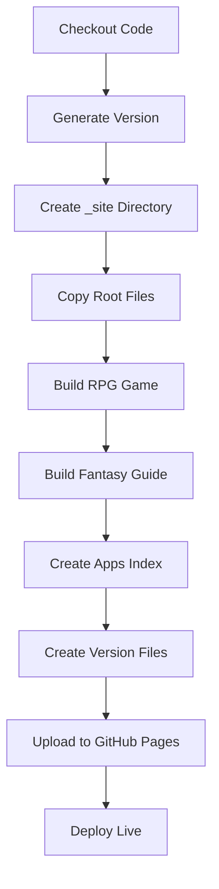

# 🚀 GitHub Pages Deployment - Complete Guide

## Overview

This repository deploys **multiple apps** to a single GitHub Pages site using a unified deployment workflow.

## 🌐 Live URLs

After deployment, your apps will be available at:

```
https://[username].github.io/[repo]/
├── /                              → Root site
├── /apps-index.html               → Beautiful app directory
├── /fantasy-reading-guide/        → Interactive Fantasy Reading Guide
├── /rpg-game/                     → RPG Adventure Game
└── /version.json                  → Global version info
```

### Example URLs
If your GitHub username is `johndoe` and repo is `fantasy-journey`:

- 🏠 **Main Site**: `https://johndoe.github.io/fantasy-journey/`
- 📱 **Apps Index**: `https://johndoe.github.io/fantasy-journey/apps-index.html`
- 📚 **Fantasy Guide**: `https://johndoe.github.io/fantasy-journey/fantasy-reading-guide/`
- ⚔️ **RPG Game**: `https://johndoe.github.io/fantasy-journey/rpg-game/`

## 📋 Apps Included

### 1. Fantasy Reading Guide
**Path:** `/fantasy-reading-guide/`

An interactive web experience to discover your perfect fantasy book subgenre.

**Features:**
- Interactive SVG map with 50+ books
- Drag, zoom, and click navigation
- YouTube video integration
- Decision-based pathfinding
- Console version logging
- Search functionality
- Progress tracking

### 2. RPG Adventure Game
**Path:** `/rpg-game/`

A text-based RPG adventure game.

**Features:**
- Character creation and progression
- Combat system
- Inventory management
- Quest system
- Save/load functionality

## 🔄 How Deployment Works

### Workflow File
**Location:** `.github/workflows/deploy-all-apps.yml`

### Triggers
The deployment automatically runs when:
1. **Push to main branch** - Production deployment
2. **Push to feature branches** - Preview deployment
3. **Manual dispatch** - On-demand deployment from Actions tab

### Build Process



1. **Checkout**: Pulls latest code
2. **Version Generation**: Creates `v1.{commits}-{sha}` version
3. **Build Structure**: Creates `_site/` deployment directory
4. **Copy Apps**: Copies both apps with their assets
5. **Inject Metadata**: Adds version info and cache busting
6. **Create Index**: Generates beautiful apps directory page
7. **Upload & Deploy**: Publishes to GitHub Pages

### Version Numbering

Each deployment gets a unique version:
```
v1.{commit-count}-{git-sha}

Example: v1.256-a1b2c3d
```

Where:
- `1` = Major version
- `256` = Total commits in repo
- `a1b2c3d` = Short git commit SHA

## 📊 What Gets Deployed

### Directory Structure

```
_site/
├── index.html                          # Root page
├── apps-index.html                     # Apps directory
├── version.json                        # Global version
├── shared/                             # Shared assets
├── fantasy-reading-guide/
│   ├── index.html                      # Reading guide app
│   ├── version.json                    # App version
│   ├── css/
│   │   └── styles.css?v=1.256-a1b2c3d  # Cache busted
│   └── js/
│       ├── data.js?v=1.256-a1b2c3d
│       ├── map.js?v=1.256-a1b2c3d
│       └── main.js?v=1.256-a1b2c3d
└── rpg-game/
    ├── index.html                      # RPG game
    ├── version.json                    # App version
    └── game.js
```

### Version Files

Each app gets its own `version.json`:

```json
{
  "version": "v1.256-a1b2c3d",
  "buildDate": "2025-10-22T23:45:23Z",
  "commitSha": "a1b2c3d4e5f6...",
  "branch": "main",
  "buildNumber": "42",
  "repository": "username/fantasy-journey",
  "deployer": "GitHub Actions",
  "app": "Fantasy Reading Guide"
}
```

## 🎨 Apps Index Page

The deployment creates a beautiful landing page at `/apps-index.html`:

**Features:**
- Gradient background
- Card-based layout for each app
- Hover animations
- Responsive design
- Version info display
- Direct links to both apps

**Preview:**
```
┌─────────────────────────────────────────┐
│      🎮 Fantasy Journey Apps            │
├─────────────┬─────────────────────────┤
│  📚         │  ⚔️                     │
│  Fantasy    │  RPG Adventure          │
│  Reading    │  Game                   │
│  Guide      │                         │
│             │  Embark on an epic      │
│  Explore    │  text-based adventure.  │
│  50+ books  │  Battle monsters!       │
│             │                         │
│  [Explore → ]│ [Start Game →]        │
└─────────────┴──────────────────────────┘
     Version v1.256-a1b2c3d | Build #42
```

## 🔧 Configuration

### Enable GitHub Pages

1. Go to your repository on GitHub
2. Click **Settings**
3. Scroll to **Pages** in left sidebar
4. Under **Source**, select:
   - **Source:** GitHub Actions
5. Save

### Branch Protection (Optional)

For production safety:
1. Settings → Branches
2. Add rule for `main`
3. Enable "Require status checks"
4. Require "Deploy All Apps" to pass

## 🚀 Manual Deployment

### From GitHub UI
1. Go to **Actions** tab
2. Select "Deploy All Apps to GitHub Pages"
3. Click "Run workflow"
4. Choose branch
5. (Optional) Enter custom version
6. Click "Run workflow"

### Custom Version
```
Workflow dispatch with version: v2.0.0-beta
```

## 📈 Monitoring Deployments

### GitHub Actions
View deployment status:
1. Go to **Actions** tab
2. See workflow runs
3. Click run for details

### Deployment Summary
Each successful deployment shows:
```
✅ Deployment Successful!
━━━━━━━━━━━━━━━━━━━━━━━━━━━━━━━━━━━━━━━━
🌐 Main URL: https://[user].github.io/[repo]/
📚 Fantasy Guide: https://[...]/fantasy-reading-guide/
⚔️ RPG Game: https://[...]/rpg-game/
📱 Apps Index: https://[...]/apps-index.html
━━━━━━━━━━━━━━━━━━━━━━━━━━━━━━━━━━━━━━━━
```

### Console Logging

Fantasy Reading Guide includes console logging:
- Open browser DevTools (F12)
- See version banner
- Performance metrics
- Developer utilities

## 🔍 Debugging

### Deployment Failed?

Check these:

1. **GitHub Pages enabled?**
   - Settings → Pages → Source: GitHub Actions

2. **Permissions correct?**
   - Workflow has `pages: write` permission
   - Repository settings allow Actions

3. **Build logs**
   - Actions tab → Failed workflow → View logs
   - Look for red errors

4. **Branch name**
   - Workflow triggers on `main` and feature branches
   - Check branch name matches trigger

### Common Issues

| Issue | Solution |
|-------|----------|
| 404 on site | Wait 2-3 minutes after deployment |
| Old version showing | Hard refresh (Ctrl+Shift+R) |
| Assets not loading | Check browser console for 404s |
| Version not updating | Clear cache, check version.json |

## 📝 Adding New Apps

To add another app to the deployment:

1. Create app directory in repo root:
   ```bash
   mkdir my-new-app
   ```

2. Edit `.github/workflows/deploy-all-apps.yml`

3. Add build step after existing apps:
   ```yaml
   - name: Build My New App
     run: |
       echo "🎯 Building My New App..."
       if [ -d my-new-app ]; then
         cp -r my-new-app _site/my-new-app
         # Add version.json etc.
       fi
   ```

4. Update `apps-index.html` generation with new card

5. Commit and push

## 🎯 Best Practices

### Development Workflow
```bash
# 1. Create feature branch
git checkout -b feature/my-feature

# 2. Make changes
# ... edit files ...

# 3. Test locally
open index.html

# 4. Commit and push
git add .
git commit -m "feat: Add new feature"
git push

# 5. Deployment auto-triggers
# Check Actions tab for status

# 6. View preview at feature branch URL
```

### Version Management
- Versions auto-increment with each commit
- Major versions: Manual tags (`v2.0.0`)
- Semantic versioning for releases
- Keep CHANGELOG.md updated

### Performance
- Assets are cache-busted automatically
- Use compression for large files
- Optimize images before committing
- Minimize JS/CSS in production

## 📚 Additional Resources

- [GitHub Pages Documentation](https://docs.github.com/pages)
- [GitHub Actions Documentation](https://docs.github.com/actions)
- [Workflow Syntax](https://docs.github.com/actions/reference/workflow-syntax-for-github-actions)
- [DEPLOYMENT.md](./DEPLOYMENT.md) - Detailed deployment docs

## 🎉 Success Indicators

Deployment successful when you see:

- ✅ Green checkmark on commit in GitHub
- ✅ "Deploy All Apps" workflow passes
- ✅ Apps accessible at GitHub Pages URLs
- ✅ Version info displays correctly
- ✅ Console logging works (Fantasy Guide)
- ✅ All assets load without 404s

## 🆘 Getting Help

If deployment fails:

1. Check Actions tab for error messages
2. Review workflow logs
3. Verify GitHub Pages settings
4. Check repository permissions
5. Hard refresh browser
6. Wait 3-5 minutes (GitHub Pages cache)

---

**Ready to Deploy?** 🚀

Push any commit to `main` or your feature branch and watch the magic happen!

```bash
git add .
git commit -m "feat: Update my app"
git push
# ✨ Deployment starts automatically!
```
